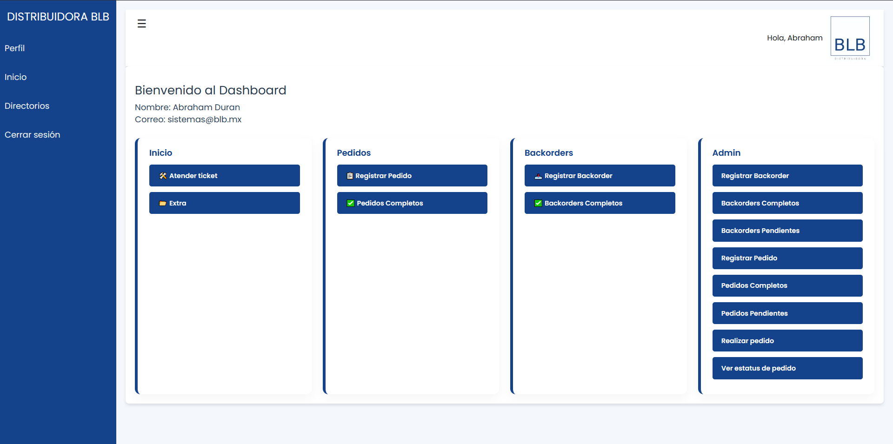

Developed by Cesar Abraham Duran Cuevas

Online Link
https://www.distribuidorablb.mx/DISTRIBUIDORABLB/

Web Application for DISTRIBUIDORA BLB
Description

# Intern System - Distribuidora BLB  

# Profile Capture

# Documentation

# 


## ✨ Features  
- ✅ Invoice registration with batches  
- ✅ Intelligent search by folio/client  
- ✅ Integration API (FastAPI) 

This project is a custom system designed to meet the specific requirements of the company DISTRIBUIDORA BLB. It is tailored to their needs and includes the following features:

    A ticketing module for the IT department to track and manage incidents.

    Internal documentation for employees.

    Integration of an endpoint and API that connects to the company's local server and performs SQL queries to interact with the Aspel system.

Installation

1- Clone the repository:
```bash
git clone https://github.com/T-crtl/ventas.git
```

2- Install the required dependencies:
```bash
pip install -r requirements.txt
```
3- Set up the database and configure the credentials.
```bash
python manage.py makemigrations
python manage.py migrate
```